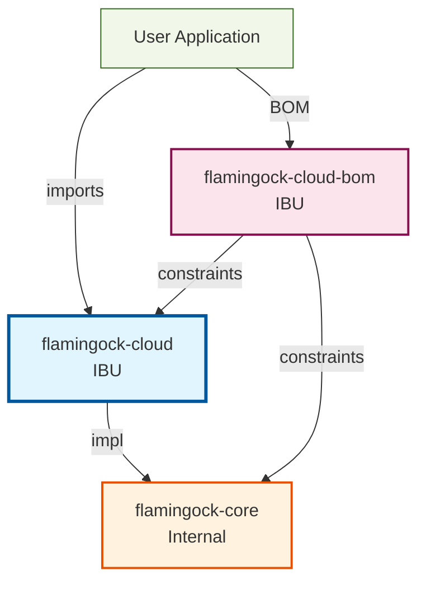
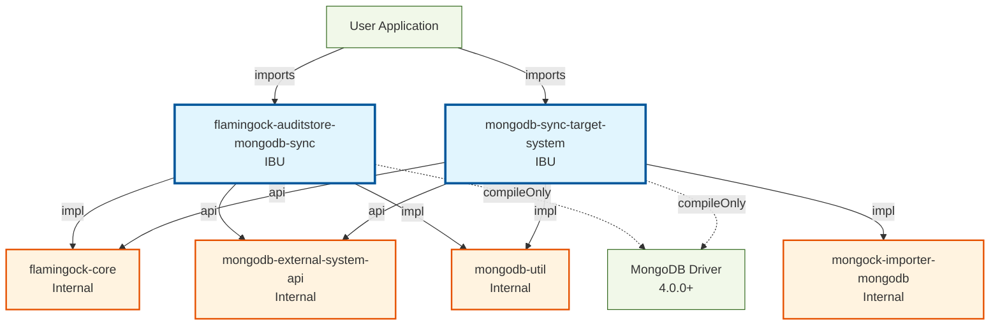
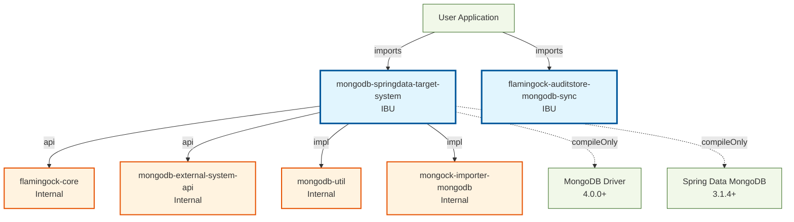
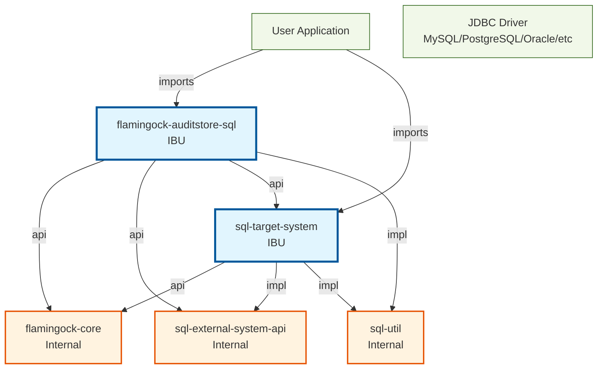
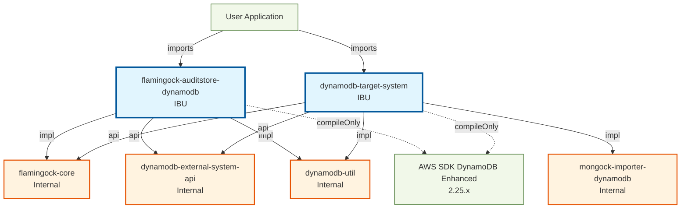
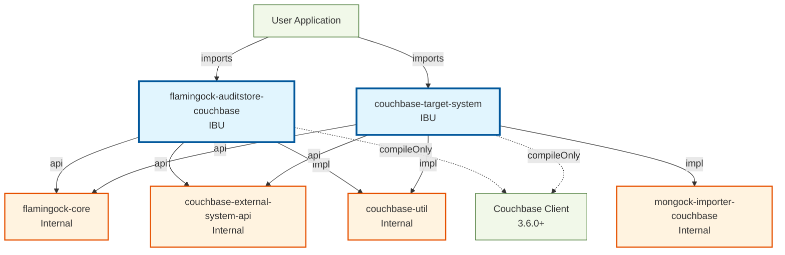

# Flamingock Project - Architecture Overview

**Document Version**: 2.0
**Date**: 2025-02-11
**Authors**: Antonio Perez Dieppa
**Audience**: New Developers, Architecture Team, Release Management  

## Table of Contents

1. [Executive Summary](#executive-summary)
2. [Module Classification](#module-classification)
3. [Architecture Diagram](#architecture-diagram)
4. [Module Dependency Layers](#module-dependency-layers)
5. [Release Impact Analysis](#release-impact-analysis)
6. [Individual Library Diagrams](#individual-library-diagrams)
   - [MongoDB Sync Integration](#mongodb-sync-integration)
   - [DynamoDB Integration](#dynamodb-integration)
   - [Couchbase Integration](#couchbase-integration)
   - [Spring Data MongoDB Integration](#spring-data-mongodb-integration)
   - [Cloud Edition](#cloud-edition)
7. [Module Relationships Summary](#module-relationships-summary)
8. [Legends](#legends)
9. [Java Compatibility Matrix](#java-compatibility-matrix)
10. [Key Architecture Principles](#key-architecture-principles)

## Related Documents

- **[Detailed Dependency Analysis](DEPENDENCY_ANALYSIS.md)** - Technical analysis of all module dependencies
- **[Action Items & Issues](ACTION_ITEMS.md)** - Critical fixes and improvements needed

## Executive Summary

This document provides a comprehensive overview of the Flamingock project's module architecture, dependencies, and structure. It includes visual representations, module classifications, and dependency relationships to help the development team understand the project's organization and make informed decisions about future development.

## Module Classification

### IBU (Import By User) - Libraries
These modules are designed to be directly imported by end users:

#### Core Extensions
- `flamingock-processor` - Annotation processor for change metadata generation
- `flamingock-graalvm` - GraalVM native image support

#### Target Systems
- `nontransactional-target-system` - Simple non-transactional execution
- `mongodb-sync-target-system` - MongoDB sync driver target system
- `mongodb-springdata-target-system` - Spring Data MongoDB target system
- `sql-target-system` - SQL database target system
- `dynamodb-target-system` - DynamoDB target system
- `couchbase-target-system` - Couchbase target system

#### Audit Stores (Community Edition)
- `flamingock-auditstore-mongodb-sync` - MongoDB sync audit store
- `flamingock-auditstore-sql` - SQL audit store (MySQL, PostgreSQL, Oracle, etc.)
- `flamingock-auditstore-dynamodb` - DynamoDB audit store
- `flamingock-auditstore-couchbase` - Couchbase audit store

#### Legacy Support
- `mongock-support` - Mongock compatibility layer and annotations

#### Platform Integration
- `flamingock-springboot-integration` - Spring Boot auto-configuration

#### Test Support
- `flamingock-test-support` - Core test utilities and mocks
- `flamingock-springboot-test-support` - Spring Boot test utilities

#### BOMs
- `flamingock-community-bom` - Community edition dependency management

### UBU (Used By User) - API Access Only
These modules provide APIs that users interact with but typically don't import directly:

- `flamingock-community` - Community edition aggregate module
- `flamingock-core-api` - Core framework APIs and annotations (`@Change`, `@Apply`, etc.)

### Internal - Implementation Details
These modules are implementation details not exposed to end users:

#### Core
- `flamingock-core` - Core engine and orchestration logic
- `flamingock-core-commons` - Shared internal utilities and common components

#### External System APIs
- `mongodb-external-system-api` - MongoDB system abstraction layer
- `sql-external-system-api` - SQL system abstraction layer
- `dynamodb-external-system-api` - DynamoDB system abstraction layer
- `couchbase-external-system-api` - Couchbase system abstraction layer

#### Database Utilities
- `general-util` - General-purpose utilities shared across modules
- `sql-util` - SQL utilities and dialect helpers
- `mongodb-util` - MongoDB-specific utilities
- `dynamodb-util` - DynamoDB-specific utilities
- `couchbase-util` - Couchbase-specific utilities

#### Legacy Importers
- `mongock-importer-mongodb` - MongoDB Mongock audit history importer
- `mongock-importer-dynamodb` - DynamoDB Mongock audit history importer
- `mongock-importer-couchbase` - Couchbase Mongock audit history importer

## Architecture Diagram

The following diagram shows the complete module dependency structure for the Flamingock Community Edition. Arrows indicate dependency direction (A → B means A depends on B).

```mermaid
graph TB
    %% Define module categories with colors
    classDef ibu fill:#e1f5fe,stroke:#01579b,stroke-width:3px
    classDef ubu fill:#f3e5f5,stroke:#4a148c,stroke-width:3px
    classDef internal fill:#fff3e0,stroke:#e65100,stroke-width:2px
    classDef bom fill:#fce4ec,stroke:#880e4f,stroke-width:2px

    %% LAYER 0: Foundation
    subgraph L0["Layer 0: Foundation"]
        direction LR
        general-util[general-util<br/>Internal]:::internal
        sql-util[sql-util<br/>Internal]:::internal
    end

    %% LAYER 1: Core API
    subgraph L1["Layer 1: Core API"]
        flamingock-core-api[flamingock-core-api<br/>UBU]:::ubu
    end

    %% LAYER 2: Core Commons
    subgraph L2["Layer 2: Core Commons"]
        flamingock-core-commons[flamingock-core-commons<br/>Internal]:::internal
    end

    %% LAYER 3: Core & Processor
    subgraph L3["Layer 3: Core Engine"]
        direction LR
        flamingock-core[flamingock-core<br/>Internal]:::internal
        flamingock-processor[flamingock-processor<br/>IBU]:::ibu
    end

    %% LAYER 4: External System APIs
    subgraph L4["Layer 4: External System APIs"]
        direction LR
        mongodb-external-system-api[mongodb-external-system-api<br/>Internal]:::internal
        sql-external-system-api[sql-external-system-api<br/>Internal]:::internal
        dynamodb-external-system-api[dynamodb-external-system-api<br/>Internal]:::internal
        couchbase-external-system-api[couchbase-external-system-api<br/>Internal]:::internal
    end

    %% LAYER 5: DB Utilities
    subgraph L5["Layer 5: Database Utilities"]
        direction LR
        mongodb-util[mongodb-util<br/>Internal]:::internal
        dynamodb-util[dynamodb-util<br/>Internal]:::internal
        couchbase-util[couchbase-util<br/>Internal]:::internal
    end

    %% LAYER 6: Legacy Importers
    subgraph L6["Layer 6: Legacy Importers"]
        direction LR
        mongock-support[mongock-support<br/>IBU]:::ibu
        mongock-importer-mongodb[mongock-importer-mongodb<br/>Internal]:::internal
        mongock-importer-dynamodb[mongock-importer-dynamodb<br/>Internal]:::internal
        mongock-importer-couchbase[mongock-importer-couchbase<br/>Internal]:::internal
    end

    %% LAYER 7: Target Systems
    subgraph L7["Layer 7: Target Systems"]
        direction LR
        nontransactional-target-system[nontransactional-target-system<br/>IBU]:::ibu
        mongodb-sync-target-system[mongodb-sync-target-system<br/>IBU]:::ibu
        mongodb-springdata-target-system[mongodb-springdata-target-system<br/>IBU]:::ibu
        sql-target-system[sql-target-system<br/>IBU]:::ibu
        dynamodb-target-system[dynamodb-target-system<br/>IBU]:::ibu
        couchbase-target-system[couchbase-target-system<br/>IBU]:::ibu
    end

    %% LAYER 8: Audit Stores
    subgraph L8["Layer 8: Audit Stores"]
        direction LR
        flamingock-auditstore-mongodb-sync[flamingock-auditstore-mongodb-sync<br/>IBU]:::ibu
        flamingock-auditstore-sql[flamingock-auditstore-sql<br/>IBU]:::ibu
        flamingock-auditstore-dynamodb[flamingock-auditstore-dynamodb<br/>IBU]:::ibu
        flamingock-auditstore-couchbase[flamingock-auditstore-couchbase<br/>IBU]:::ibu
    end

    %% LAYER 9: Aggregates & Platform
    subgraph L9["Layer 9: Aggregates & Platform"]
        direction LR
        flamingock-community[flamingock-community<br/>UBU]:::ubu
        flamingock-springboot-integration[flamingock-springboot-integration<br/>IBU]:::ibu
        flamingock-graalvm[flamingock-graalvm<br/>IBU]:::ibu
    end

    %% LAYER 10: Test Support
    subgraph L10["Layer 10: Test Support"]
        direction LR
        flamingock-test-support[flamingock-test-support<br/>IBU]:::ibu
        flamingock-springboot-test-support[flamingock-springboot-test-support<br/>IBU]:::ibu
    end

    %% BOMs (no runtime dependencies)
    subgraph BOMs["BOMs"]
        flamingock-community-bom[flamingock-community-bom<br/>BOM]:::bom
    end

    %% =====================
    %% DEPENDENCY ARROWS
    %% =====================

    %% Layer 1 → Layer 0
    flamingock-core-api --> general-util

    %% Layer 2 → Layer 1 & 0
    flamingock-core-commons --> flamingock-core-api
    flamingock-core-commons --> general-util

    %% Layer 3 → Layer 2 & 0
    flamingock-core --> flamingock-core-commons
    flamingock-core --> general-util
    flamingock-processor --> flamingock-core-commons
    flamingock-processor --> general-util

    %% Layer 4 → Layer 1 & 0
    mongodb-external-system-api --> flamingock-core-api
    sql-external-system-api --> flamingock-core-api
    sql-external-system-api --> sql-util
    dynamodb-external-system-api --> flamingock-core-api
    couchbase-external-system-api --> flamingock-core-api

    %% Layer 5 → Layer 3 & 0
    mongodb-util --> flamingock-core
    dynamodb-util --> flamingock-core
    dynamodb-util --> general-util
    couchbase-util --> flamingock-core

    %% Layer 6 → Layer 2 & 5
    mongock-support --> flamingock-core-api
    mongock-support --> flamingock-core
    mongock-importer-mongodb --> flamingock-core-commons
    mongock-importer-dynamodb --> flamingock-core-commons
    mongock-importer-dynamodb --> dynamodb-util
    mongock-importer-couchbase --> flamingock-core-commons
    mongock-importer-couchbase --> couchbase-util

    %% Layer 7 → Layer 3, 4, 5, 6
    nontransactional-target-system --> flamingock-core
    mongodb-sync-target-system --> flamingock-core
    mongodb-sync-target-system --> mongodb-external-system-api
    mongodb-sync-target-system --> mongodb-util
    mongodb-sync-target-system --> mongock-importer-mongodb
    mongodb-springdata-target-system --> flamingock-core
    mongodb-springdata-target-system --> mongodb-external-system-api
    mongodb-springdata-target-system --> mongodb-util
    mongodb-springdata-target-system --> mongock-importer-mongodb
    sql-target-system --> flamingock-core
    sql-target-system --> sql-external-system-api
    sql-target-system --> sql-util
    dynamodb-target-system --> flamingock-core
    dynamodb-target-system --> dynamodb-external-system-api
    dynamodb-target-system --> dynamodb-util
    dynamodb-target-system --> mongock-importer-dynamodb
    couchbase-target-system --> flamingock-core
    couchbase-target-system --> couchbase-external-system-api
    couchbase-target-system --> couchbase-util
    couchbase-target-system --> mongock-importer-couchbase

    %% Layer 8 → Layer 3, 4, 5, 7
    flamingock-auditstore-mongodb-sync --> flamingock-core
    flamingock-auditstore-mongodb-sync --> mongodb-external-system-api
    flamingock-auditstore-mongodb-sync --> mongodb-util
    flamingock-auditstore-sql --> flamingock-core
    flamingock-auditstore-sql --> sql-external-system-api
    flamingock-auditstore-sql --> sql-target-system
    flamingock-auditstore-sql --> sql-util
    flamingock-auditstore-dynamodb --> flamingock-core
    flamingock-auditstore-dynamodb --> dynamodb-external-system-api
    flamingock-auditstore-dynamodb --> dynamodb-util
    flamingock-auditstore-couchbase --> flamingock-core
    flamingock-auditstore-couchbase --> couchbase-external-system-api
    flamingock-auditstore-couchbase --> couchbase-util

    %% Layer 9 → Layer 1, 2, 3, 7, 8
    flamingock-community --> flamingock-core
    flamingock-community --> flamingock-core-api
    flamingock-community --> nontransactional-target-system
    flamingock-community --> mongodb-sync-target-system
    flamingock-community --> mongodb-springdata-target-system
    flamingock-community --> sql-target-system
    flamingock-community --> dynamodb-target-system
    flamingock-community --> couchbase-target-system
    flamingock-community --> flamingock-auditstore-mongodb-sync
    flamingock-community --> flamingock-auditstore-sql
    flamingock-community --> flamingock-auditstore-dynamodb
    flamingock-community --> flamingock-auditstore-couchbase
    flamingock-springboot-integration --> flamingock-core
    flamingock-springboot-integration --> flamingock-core-commons
    flamingock-graalvm --> flamingock-core
    flamingock-graalvm --> flamingock-core-commons

    %% Layer 10 → Layer 3, 9
    flamingock-test-support --> flamingock-core
    flamingock-springboot-test-support --> flamingock-test-support
    flamingock-springboot-test-support --> flamingock-core
    flamingock-springboot-test-support --> flamingock-core-commons

    %% Legend
    subgraph Legend["Module Type Legend"]
        direction LR
        IBU_Legend[IBU - Import By User<br/>Libraries for direct import]:::ibu
        UBU_Legend[UBU - Used By User<br/>API access only]:::ubu
        Internal_Legend[Internal<br/>Implementation details]:::internal
        BOM_Legend[BOM<br/>Dependency management]:::bom
    end
```

## Module Dependency Layers

This section provides a detailed layer-by-layer breakdown of module dependencies, useful for understanding build order and release impact.

### Layer 0: Foundation (No Internal Dependencies)
| Module | Description |
|--------|-------------|
| `general-util` | General-purpose utilities shared across all modules |
| `sql-util` | SQL utilities and dialect helpers for database operations |

### Layer 1: Core API
| Module | Dependencies | Description |
|--------|--------------|-------------|
| `flamingock-core-api` | general-util | Public API annotations (`@Change`, `@Apply`) and interfaces |

### Layer 2: Core Commons
| Module | Dependencies | Description |
|--------|--------------|-------------|
| `flamingock-core-commons` | flamingock-core-api, general-util | Shared internal utilities, preview system, and common components |

### Layer 3: Core Engine & Processor
| Module | Dependencies | Description |
|--------|--------------|-------------|
| `flamingock-core` | flamingock-core-commons, general-util | Core engine and orchestration logic |
| `flamingock-processor` | flamingock-core-commons, general-util | Annotation processor for pipeline generation |

### Layer 4: External System APIs
| Module | Dependencies | Description |
|--------|--------------|-------------|
| `mongodb-external-system-api` | flamingock-core-api | MongoDB system abstraction layer |
| `sql-external-system-api` | flamingock-core-api, sql-util | SQL system abstraction layer |
| `dynamodb-external-system-api` | flamingock-core-api | DynamoDB system abstraction layer |
| `couchbase-external-system-api` | flamingock-core-api | Couchbase system abstraction layer |

### Layer 5: Database Utilities
| Module | Dependencies | Description |
|--------|--------------|-------------|
| `mongodb-util` | flamingock-core | MongoDB-specific utilities and helpers |
| `dynamodb-util` | flamingock-core, general-util | DynamoDB-specific utilities and helpers |
| `couchbase-util` | flamingock-core | Couchbase-specific utilities and helpers |

### Layer 6: Legacy Importers
| Module | Dependencies | Description |
|--------|--------------|-------------|
| `mongock-support` | flamingock-core-api, flamingock-core | Mongock compatibility annotations |
| `mongock-importer-mongodb` | flamingock-core-commons | MongoDB Mongock audit history importer |
| `mongock-importer-dynamodb` | flamingock-core-commons, dynamodb-util | DynamoDB Mongock audit history importer |
| `mongock-importer-couchbase` | flamingock-core-commons, couchbase-util | Couchbase Mongock audit history importer |

### Layer 7: Target Systems
| Module | Dependencies | Description |
|--------|--------------|-------------|
| `nontransactional-target-system` | flamingock-core | Simple non-transactional execution |
| `mongodb-sync-target-system` | flamingock-core, mongodb-external-system-api, mongodb-util, mongock-importer-mongodb | MongoDB sync driver target |
| `mongodb-springdata-target-system` | flamingock-core, mongodb-external-system-api, mongodb-util, mongock-importer-mongodb | Spring Data MongoDB target |
| `sql-target-system` | flamingock-core, sql-external-system-api, sql-util | SQL database target |
| `dynamodb-target-system` | flamingock-core, dynamodb-external-system-api, dynamodb-util, mongock-importer-dynamodb | DynamoDB target |
| `couchbase-target-system` | flamingock-core, couchbase-external-system-api, couchbase-util, mongock-importer-couchbase | Couchbase target |

### Layer 8: Audit Stores
| Module | Dependencies | Description |
|--------|--------------|-------------|
| `flamingock-auditstore-mongodb-sync` | flamingock-core, mongodb-external-system-api, mongodb-util | MongoDB sync audit store |
| `flamingock-auditstore-sql` | flamingock-core, sql-external-system-api, sql-target-system, sql-util | SQL audit store |
| `flamingock-auditstore-dynamodb` | flamingock-core, dynamodb-external-system-api, dynamodb-util | DynamoDB audit store |
| `flamingock-auditstore-couchbase` | flamingock-core, couchbase-external-system-api, couchbase-util | Couchbase audit store |

### Layer 9: Aggregates & Platform Integration
| Module | Dependencies | Description |
|--------|--------------|-------------|
| `flamingock-community` | flamingock-core, all target-systems, all audit-stores | Community Edition aggregate |
| `flamingock-springboot-integration` | flamingock-core, flamingock-core-commons | Spring Boot auto-configuration |
| `flamingock-graalvm` | flamingock-core, flamingock-core-commons | GraalVM native image support |

### Layer 10: Test Support
| Module | Dependencies | Description |
|--------|--------------|-------------|
| `flamingock-test-support` | flamingock-core | Core test utilities and mocks |
| `flamingock-springboot-test-support` | flamingock-test-support, flamingock-core, flamingock-core-commons | Spring Boot test utilities |

## Release Impact Analysis

This table helps determine which modules need a version bump when a specific module changes. Use this for release planning and dependency impact assessment.

| If you change... | These modules are affected (need version bump) |
|------------------|------------------------------------------------|
| **`general-util`** | **ALL modules** (foundational dependency) |
| **`sql-util`** | sql-external-system-api, sql-target-system, flamingock-auditstore-sql |
| **`flamingock-core-api`** | flamingock-core-commons, all external-system-apis, mongock-support, flamingock-community, and all modules above them |
| **`flamingock-core-commons`** | flamingock-processor, flamingock-core, all mongock-importers, flamingock-springboot-integration, flamingock-graalvm, flamingock-springboot-test-support |
| **`flamingock-core`** | mongodb-util, dynamodb-util, couchbase-util, mongock-support, all target-systems, all audit-stores, flamingock-community, flamingock-springboot-integration, flamingock-graalvm, flamingock-test-support, flamingock-springboot-test-support |
| **`flamingock-processor`** | (annotation processor - typically no runtime impact on other modules) |
| **`mongodb-util`** | mongodb-sync-target-system, mongodb-springdata-target-system, flamingock-auditstore-mongodb-sync |
| **`dynamodb-util`** | mongock-importer-dynamodb, dynamodb-target-system, flamingock-auditstore-dynamodb |
| **`couchbase-util`** | mongock-importer-couchbase, couchbase-target-system, flamingock-auditstore-couchbase |
| **`mongodb-external-system-api`** | mongodb-sync-target-system, mongodb-springdata-target-system, flamingock-auditstore-mongodb-sync, flamingock-community |
| **`sql-external-system-api`** | sql-target-system, flamingock-auditstore-sql, flamingock-community |
| **`dynamodb-external-system-api`** | dynamodb-target-system, flamingock-auditstore-dynamodb, flamingock-community |
| **`couchbase-external-system-api`** | couchbase-target-system, flamingock-auditstore-couchbase, flamingock-community |
| **`mongock-importer-mongodb`** | mongodb-sync-target-system, mongodb-springdata-target-system |
| **`mongock-importer-dynamodb`** | dynamodb-target-system |
| **`mongock-importer-couchbase`** | couchbase-target-system |
| **`mongodb-sync-target-system`** | flamingock-community |
| **`sql-target-system`** | flamingock-auditstore-sql, flamingock-community |
| **`flamingock-auditstore-*`** | flamingock-community |
| **`flamingock-community`** | (top-level aggregate - no dependents in scope) |
| **`flamingock-test-support`** | flamingock-springboot-test-support |
| **`flamingock-springboot-integration`** | (top-level - no dependents) |
| **`flamingock-graalvm`** | (top-level - no dependents) |

## Legends

### Module Types
- **IBU (Import By User)**: Libraries designed for direct import by end users
- **UBU (Used By User)**: Modules providing APIs that users access but don't import directly
- **Internal**: Implementation modules not exposed to end users
- **BOM**: Bill of Materials for dependency management

### Dependency Types
- **`api`** (thick arrows): Dependencies exposed in the module's public API
- **`implementation`** (normal arrows): Internal dependencies not exposed to consumers
- **`compileOnly`** (dotted arrows): Dependencies required at compile time but not bundled

## Java Compatibility Matrix

| Module | Java Version | Target Users |
|--------|--------------|--------------|
| **Core Framework** | Java 8+ | All |
| `flamingock-graalvm` | Java 17+ | GraalVM users |
| `flamingock-springboot-integration` | Java 17+ | Spring Boot 3.x users |
| `flamingock-auditstore-mongodb-springdata` | Java 17+ | Spring Data 4.x users |
| **All Other Modules** | Java 8+ | Broad compatibility |

## Key Architecture Principles

### 1. **Clear Separation of Concerns**
- **Core**: Framework implementation and APIs
- **Community**: Database-specific implementations
- **Cloud**: SaaS/managed service implementation
- **Platform**: Framework integrations (Spring Boot, etc.)
- **Utils**: Shared utilities and helpers

### 2. **Dependency Management**
- Database auditStores use `compileOnly` to avoid version lock-in
- Public APIs properly exposed via `api` dependencies
- Internal implementations hidden via `implementation` dependencies

### 3. **User Experience**
- **IBU modules**: Direct imports for end users
- **UBU modules**: API access without direct import
- **Internal modules**: Implementation details hidden from users

## Individual Library Diagrams

### Cloud Edition

### MongoDB Sync Community Edition

### Spring Data MongoDB Community Edition

### SQL Community Edition

### DynamoDB Community Edition

### Couchbase Community Edition

## Module Relationships Summary

### Core Dependencies
- Everything flows through `flamingock-core` and `flamingock-core-commons`
- `flamingock-core-api` provides stable APIs for users (`@Change`, `@Apply`, etc.)
- `general-util` and `sql-util` provide foundational shared functionality

### External System APIs
- Each database technology has a dedicated external-system-api module
- These provide abstraction layers between core and database-specific implementations
- Allow for clean separation between audit stores and target systems

### Target Systems & Audit Stores
- **Target Systems**: Handle change execution for specific databases
- **Audit Stores**: Handle change tracking/auditing for specific databases
- Both depend on the same external-system-api but serve different purposes

### Community Edition Flow
- `flamingock-community` aggregates all target-systems and audit-stores
- Database-specific utilities support both audit stores and target systems
- Legacy importers (`mongock-importer-*`) enable migration from Mongock

### Platform Integration
- Spring Boot integration provides auto-configuration
- Test support modules enable easy testing in applications
- Processor enables compile-time code generation for change metadata

