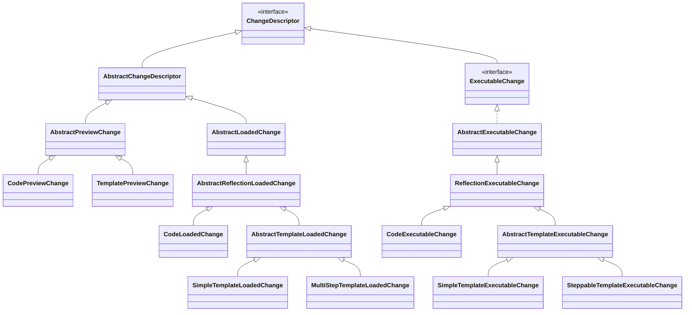

# Change Hierarchy

Static class hierarchy rooted at `ChangeDescriptor`. Every change in Flamingock — from the parsed YAML/annotation `Preview`, to the validated `Loaded` form, to the runtime `Executable` instance — is a `ChangeDescriptor`. The tree below shows how the three phases and their **Code** vs **Template** branches relate by inheritance.

## Diagram

The **Preview** and **Loaded** branches share `AbstractChangeDescriptor`. The **Executable** branch is a parallel hierarchy: it reaches `ChangeDescriptor` via the `ExecutableChange` interface (not via `AbstractChangeDescriptor`), so it does not share implementation with the other two phases.

## Class locations

### Root
| Class | Path |
|-------|------|
| `ChangeDescriptor` | `core/flamingock-core-commons/src/main/java/io/flamingock/internal/common/core/change/ChangeDescriptor.java` |
| `AbstractChangeDescriptor` | `core/flamingock-core-commons/src/main/java/io/flamingock/internal/common/core/change/AbstractChangeDescriptor.java` |

### Preview phase
| Class | Path |
|-------|------|
| `AbstractPreviewChange` | `core/flamingock-core-commons/src/main/java/io/flamingock/internal/common/core/preview/AbstractPreviewChange.java` |
| `CodePreviewChange` | `core/flamingock-core-commons/src/main/java/io/flamingock/internal/common/core/preview/CodePreviewChange.java` |
| `TemplatePreviewChange` | `core/flamingock-core-commons/src/main/java/io/flamingock/internal/common/core/preview/TemplatePreviewChange.java` |

### Loaded phase
| Class | Path |
|-------|------|
| `AbstractLoadedChange` | `core/flamingock-core/src/main/java/io/flamingock/internal/core/change/loaded/AbstractLoadedChange.java` |
| `AbstractReflectionLoadedChange` | `core/flamingock-core/src/main/java/io/flamingock/internal/core/change/loaded/AbstractReflectionLoadedChange.java` |
| `CodeLoadedChange` | `core/flamingock-core/src/main/java/io/flamingock/internal/core/change/loaded/CodeLoadedChange.java` |
| `AbstractTemplateLoadedChange` | `core/flamingock-core/src/main/java/io/flamingock/internal/core/change/loaded/AbstractTemplateLoadedChange.java` |
| `SimpleTemplateLoadedChange` | `core/flamingock-core/src/main/java/io/flamingock/internal/core/change/loaded/SimpleTemplateLoadedChange.java` |
| `MultiStepTemplateLoadedChange` | `core/flamingock-core/src/main/java/io/flamingock/internal/core/change/loaded/MultiStepTemplateLoadedChange.java` |

### Executable phase
| Class | Path |
|-------|------|
| `ExecutableChange` | `core/flamingock-core/src/main/java/io/flamingock/internal/core/change/executable/ExecutableChange.java` |
| `AbstractExecutableChange` | `core/flamingock-core/src/main/java/io/flamingock/internal/core/change/executable/AbstractExecutableChange.java` |
| `ReflectionExecutableChange` | `core/flamingock-core/src/main/java/io/flamingock/internal/core/change/executable/ReflectionExecutableChange.java` |
| `CodeExecutableChange` | `core/flamingock-core/src/main/java/io/flamingock/internal/core/change/executable/CodeExecutableChange.java` |
| `AbstractTemplateExecutableChange` | `core/flamingock-core/src/main/java/io/flamingock/internal/core/change/executable/AbstractTemplateExecutableChange.java` |
| `SimpleTemplateExecutableChange` | `core/flamingock-core/src/main/java/io/flamingock/internal/core/change/executable/SimpleTemplateExecutableChange.java` |
| `SteppableTemplateExecutableChange` | `core/flamingock-core/src/main/java/io/flamingock/internal/core/change/executable/SteppableTemplateExecutableChange.java` |
