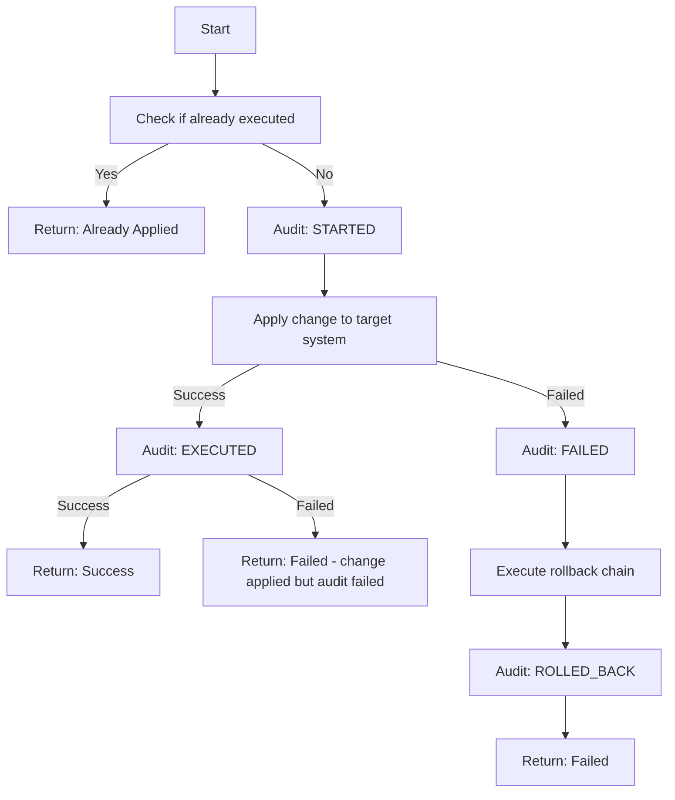
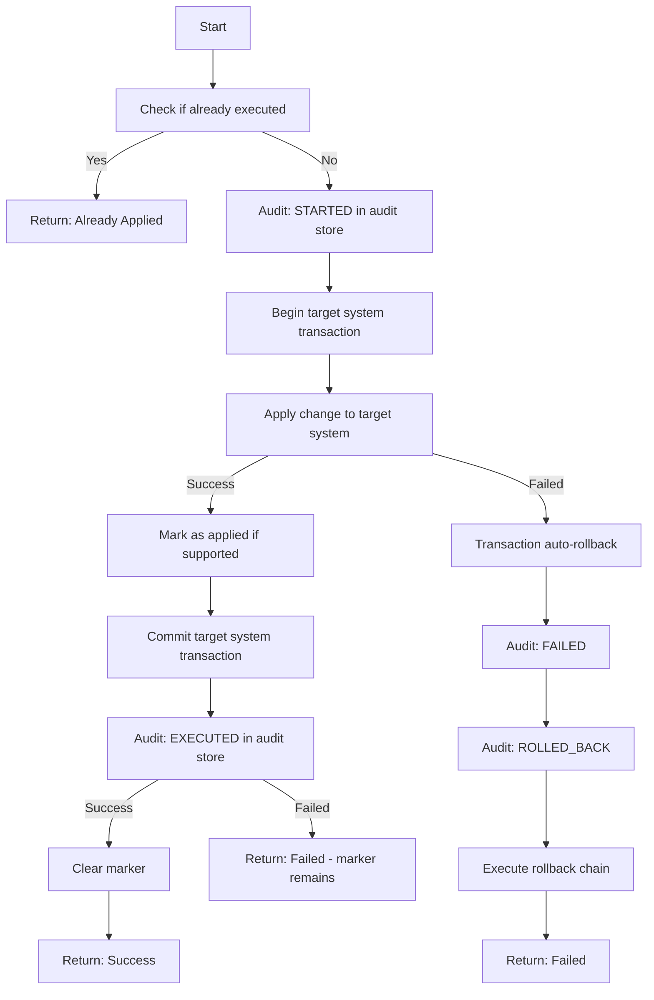
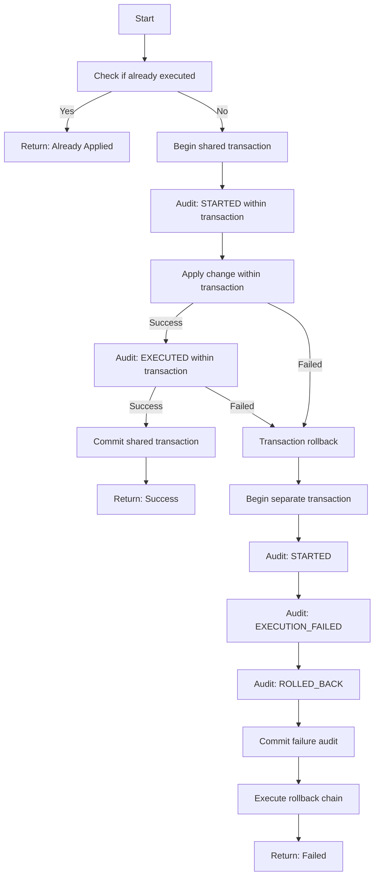
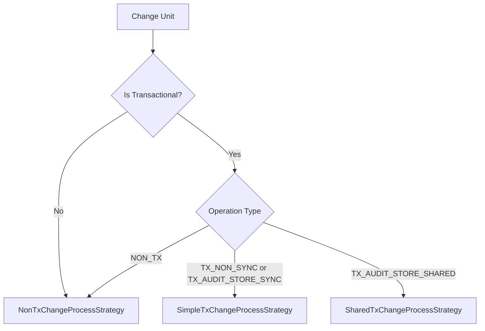

# Change Process Strategies

This document provides a comprehensive guide to Flamingock's change process execution strategies, including execution flows, state outcomes, and strategy selection criteria.

## Overview

Flamingock uses a strategy pattern to handle change execution across different target system types. Each strategy is optimized for specific transactional characteristics and audit store relationships, ensuring optimal consistency guarantees and performance.

## Strategy Types

### 1. NonTxChangeProcessStrategy

**Use Case**: Non-transactional target systems (message queues, REST services, S3 buckets, external APIs)

**Key Characteristics**:
- Changes cannot be atomically rolled back
- Separate audit store operations
- Best-effort rollback chain execution
- Manual intervention may be required for full consistency

#### Execution Flow

#### State Outcomes

| Scenario | Target System State | Audit Store State |
|----------|-------------------|------------------|
| Full success | Change applied | STARTED → EXECUTED |
| Change execution failure | Unchanged, rollback attempted | STARTED → FAILED → ROLLED_BACK |
| Change success, audit EXECUTED failure | Change applied | STARTED |
| Change execution failure, audit FAILED failure | Unchanged, rollback attempted | STARTED |
| Change execution failure, audit ROLLED_BACK failure | Unchanged, rollback attempted | STARTED → FAILED |
| Process interruption | Potentially inconsistent | STARTED |

### 2. SimpleTxChangeProcessStrategy  

**Use Case**: Transactional target systems with separate audit store

**Key Characteristics**:
- Target system supports transactions
- Separate audit store (different database or cloud)
- Optional marker support for enhanced recovery
- Automatic transaction rollback on failure

#### Execution Flow

#### State Outcomes

| Scenario | Target System State | Audit Store State | Marker State |
|----------|-------------------|------------------|--------------|
| Full success | Change committed | STARTED → EXECUTED | Cleared |
| Execution failure | Transaction rolled back | STARTED → FAILED → ROLLED_BACK | None |
| Audit failure after success | Change committed | STARTED → FAILED | Remains |
| Process interruption | Potentially inconsistent | STARTED | May remain |

#### Marker Behavior

- **With Marker Support**: Creates recovery marker during transaction
- **NoOp Marker**: No marker created, recovery relies on audit trail only
- **Marker Benefits**: Provides clear indication of change application status

### 3. SharedTxChangeProcessStrategy

**Use Case**: Target system and audit store share the same database

**Key Characteristics**:  
- Strongest consistency guarantees
- Atomic commit of both change and audit
- Separate failure audit transaction
- Safe retry semantics

#### Execution Flow

#### State Outcomes

| Scenario                     | Target System State         | Audit Store State                        |
|------------------------------|-----------------------------|------------------------------------------|
| Full success                 | Change committed atomically | STARTED → EXECUTED                       |
| Execution failure with audit | No changes committed        | STARTED → EXECUTION_FAILED → ROLLED_BACK |
| Complete failure             | No changes committed        | No audit trail                           |

## Strategy Selection Logic

The `ChangeProcessStrategyFactory` selects strategies based on:

### Operation Types

- **NON_TX**: Non-transactional operations
- **TX_NON_SYNC**: Transactional with non-synchronized audit
- **TX_AUDIT_STORE_SYNC**: Transactional with synchronized but separate audit  
- **TX_AUDIT_STORE_SHARED**: Transactional with shared database audit

## Consistency Guarantees

### Strongest to Weakest Consistency

1. **SharedTxChangeProcessStrategy**: Atomic change + audit
2. **SimpleTxChangeProcessStrategy with Marker**: Transactional change + recovery marker
3. **SimpleTxChangeProcessStrategy without Marker**: Transactional change only
4. **NonTxChangeProcessStrategy**: Best-effort consistency

### Recovery Capabilities

- **SharedTx**: Automatic recovery - failed changes are safe to retry
- **SimpleTx with Marker**: Near-automatic recovery using marker status
- **SimpleTx without Marker**: Semi-automatic recovery using audit trail
- **NonTx**: Manual intervention often required

## Best Practices

### Strategy Selection

1. **Use SharedTx when possible** - provides strongest guarantees
2. **Enable markers in SimpleTx** - improves recovery automation  
3. **Design rollback chains carefully** - critical for NonTx strategy
4. **Monitor audit trail completeness** - key for all recovery scenarios

### Error Handling

1. **Log execution details** - all strategies provide comprehensive logging
2. **Design idempotent changes** - enables safe retry operations
3. **Test rollback scenarios** - especially important for NonTx systems
4. **Monitor partial execution states** - watch for interrupted processes

### Performance Considerations  

1. **SharedTx**: Highest consistency, potential for lock contention
2. **SimpleTx**: Good balance of consistency and performance
3. **NonTx**: Highest performance, lowest consistency guarantees

## Implementation Notes

### Common Audit Operations

All strategies use consistent audit operations:
- `auditAndLogStartExecution` - Records change initiation
- `auditAndLogExecution` - Records execution results  
- `auditAndLogManualRollback` - Records manual rollback operations
- `auditAndLogAutoRollback` - Records automatic transaction rollbacks

### Execution Runtime

The execution runtime provides:
- Dependency injection context
- Lock management proxies
- Security context propagation
- Session-scoped resource management

### Legacy Support

Current implementation includes legacy target system operations that will be removed as all strategies are fully implemented. This ensures backward compatibility during the transition period.