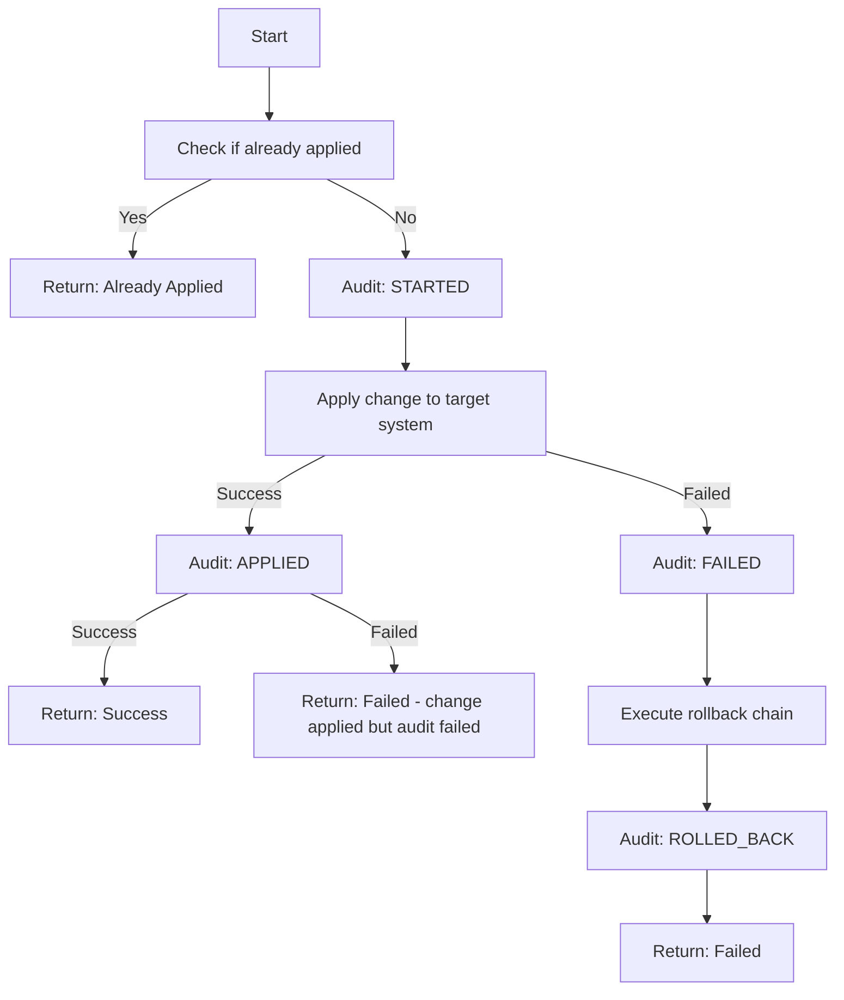
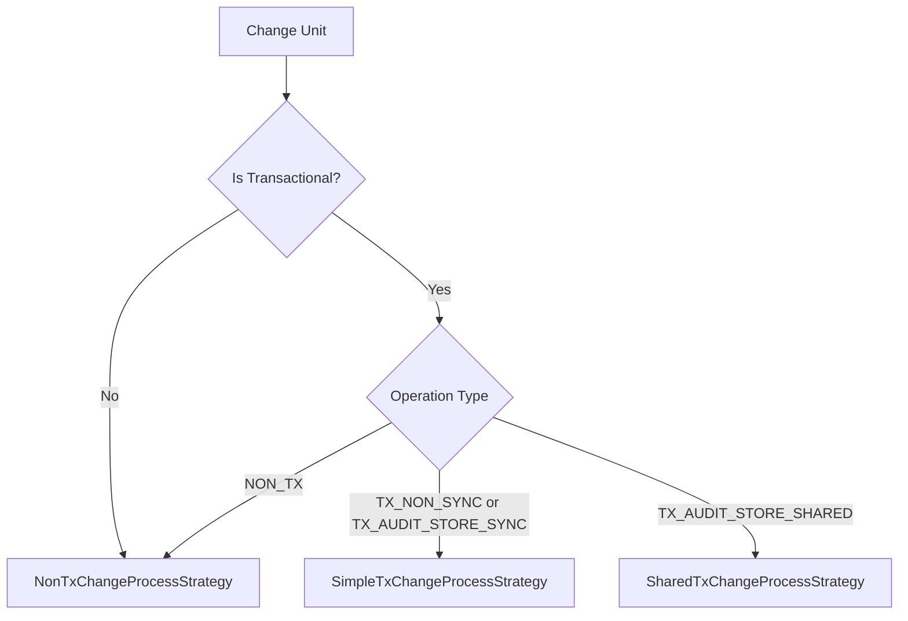

# Change Process Strategies

This document provides a comprehensive guide to Flamingock's change process execution strategies, including execution flows, state outcomes, and strategy selection criteria.

## Overview

Flamingock uses a strategy pattern to handle change execution across different target system types. Each strategy is optimized for specific transactional characteristics and audit store relationships, ensuring optimal consistency guarantees and performance.

## Strategy Types

### 1. NonTxChangeProcessStrategy

**Use Case**: Non-transactional target systems (message queues, REST services, S3 buckets, external APIs)

**Key Characteristics**:
- Changes cannot be atomically rolled back
- Separate audit store operations
- Best-effort rollback chain execution
- **Recovery capability**: Manual intervention if rollback not successfully applied

#### Execution Flow

#### State Outcomes

| Scenario                                            | Target System State           | Audit Store State              |
|-----------------------------------------------------|-------------------------------|--------------------------------|
| Full success                                        | Change applied                | STARTED → APPLIED              |
| Change execution failure                            | Unchanged, rollback attempted | STARTED → FAILED → ROLLED_BACK |
| Change success, audit EXECUTED failure              | Change applied                | STARTED                        |
| Change execution failure, audit FAILED failure      | Unchanged, rollback attempted | STARTED                        |
| Change execution failure, audit ROLLED_BACK failure | Unchanged, rollback attempted | STARTED → FAILED               |
| Process interruption                                | Potentially inconsistent      | STARTED                        |

### 2. SimpleTxChangeProcessStrategy  

**Use Case**: Transactional target systems with separate audit store

**Key Characteristics**:
- Target system supports transactions
- Separate audit store (different database or cloud)
- Optional marker support for enhanced recovery
- Automatic transaction rollback on failure
- **Recovery capability**:
  - **With Marker**: Near-automatic recovery using marker status
  - **Without Marker**: Semi-automatic recovery using audit trail

#### Execution Flow

#### State Outcomes

| Scenario                    | Target System State      | Audit Store State              | Marker State |
|-----------------------------|--------------------------|--------------------------------|--------------|
| Full success                | Change committed         | STARTED → APPLIED             | Cleared      |
| Execution failure           | Transaction rolled back  | STARTED → FAILED → ROLLED_BACK | None         |
| Audit failure after success | Change committed         | STARTED → FAILED               | Remains      |
| Process interruption        | Potentially inconsistent | STARTED                        | May remain   |

#### Marker Behavior

- **With Marker Support**: Creates recovery marker during transaction
- **NoOp Marker**: No marker created, recovery relies on audit trail only
- **Marker Benefits**: Provides clear indication of change application status

### 3. SharedTxChangeProcessStrategy

**Use Case**: Target system and audit store share the same database

**Key Characteristics**:  
- Strongest consistency guarantees
- Atomic commit of both change and audit
- Separate failure audit transaction
- Safe retry semantics
- **Recovery capability**: Automatic recovery - failed changes are safe to retry

#### Execution Flow

#### State Outcomes

| Scenario                     | Target System State         | Audit Store State                        |
|------------------------------|-----------------------------|------------------------------------------|
| Full success                 | Change committed atomically | STARTED → APPLIED                       |
| Execution failure with audit | No changes committed        | STARTED → EXECUTION_FAILED → ROLLED_BACK |
| Complete failure             | No changes committed        | No audit trail                           |

## Strategy Selection Logic

The `ChangeProcessStrategyFactory` selects strategies based on:

