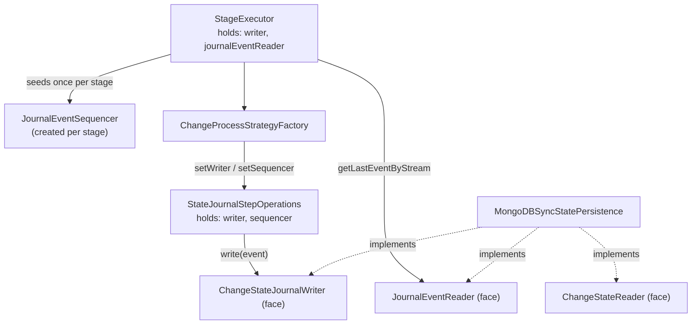

# Design: Writing ChangeState and JournalEvent together

**Status:** Proposal for discussion
**Scope:** How the audit-store persistence writes a change-state transition and its journal event atomically, and how the stream sequence is assigned.
**Related:** [ADR-0001](./ADR-0001-separate-local-operational-state-from-centralized-audit.md) (separating local operational state from centralized audit), [CHANGE_PROCESS_STRATEGIES](./CHANGE_PROCESS_STRATEGIES.md).

---

## 1. Context

We are introducing the **local journal** — a durable, append-oriented buffer of events that mirror change-state transitions and are later synchronized to Flamingock Cloud (see ADR-0001). The MongoDB-sync implementation and the read/acknowledge path already exist. This document defines **how events are written**.

Every time Flamingock records a change-state transition (`STARTED`, `APPLIED`/`EXECUTION_FAILED`, `ROLLED_BACK`, …) we must also append a corresponding **JournalEvent**. The two records must stay consistent: we never want a state transition without its event, or an event without its state.

### Decisions already taken (the premises this design builds on)

These are settled and frame everything below:

1. **No shared change/audit transaction.** The user's change and the audit/state write are treated as fully independent. Rollback experience is delivered through **compensation**, not through a database transaction shared with the change. This gives consistent behavior across transactional *and* non-transactional changes. *(This removes any need for the state+journal write to join the change's transaction.)*
2. **The persistence layer owns the state+journal transaction.** The only thing that must be atomic is *ChangeState + JournalEvent*, and both live in the audit-store database. Each database's persistence implementation owns that transaction boundary internally.
3. **The stream is the stage.** "Stream" is a generic ordering concept; in this context it is materialized by the **stage**. Ordering is guaranteed per stage.
4. **Lock granularity is at most per stage.** A running stage holds the lock, so there is a **single active writer per stream**. This makes an in-memory sequence counter safe.
5. **The caller owns the sequence.** The sequence number is *not* read from the database on every write. It is seeded **once per stream** from the journal and then incremented **in memory** for the rest of the run.

### Terminology note

"Audit" is being renamed to **ChangeState** across the codebase. This document uses the target names (`ChangeState`, `ChangeStateReader`, `ChangeStateJournalWriter`). Where it helps, the current name is noted in parentheses.

---

## 2. The core idea

- The **caller** (the execution layer, scoped to a stage) seeds a per-stream counter once, then assigns each event's `streamSequence` in memory.
- The **persistence** receives a fully-formed `JournalEvent` and writes **two records atomically**: the `ChangeState` (into the state collection) and the `JournalEvent` (into the journal collection). It is stateless and performs no read to write.
- The **`JournalEvent` carries the `ChangeState` as its `data`**, so a single object flows into the writer — no redundant second parameter.

This satisfies the two hard constraints:

- **DynamoDB cannot split the write.** Two records are atomic only inside one `TransactWriteItems` call, so the write *must* be a single store-level operation receiving both. One merged writer, one argument.
- **No per-write database read.** Sequence assignment is a single seed read per stream, then in-memory — the persistence never reads in order to write.

Safety rests on premise 4: the stage lock guarantees one writer per stream. The unique indexes on `(streamId, streamSequence)` and `eventId` are the backstop — if the single-writer assumption is ever violated (double run, bug), the second writer collides instead of silently duplicating.

---

## 3. Components

### Interfaces (segregated by concern)

| Interface | Kind | Methods (indicative) | Consumers |
|-----------|------|----------------------|-----------|
| `ChangeStateJournalWriter` *(was `AuditWriter`)* | **write, merged** | `Result write(JournalEvent<ChangeState> event)` | execution layer (the single write chokepoint) |
| `ChangeStateReader` *(was `AuditReader`)* | read | `getStateHistory()`, … | already-applied detection, audit-list operations |
| `JournalEventReader` | read | `getLastEventByStream(streamId)`, `getUnacknowledgedEvents(limit)` | sequence seeding, cloud-sync worker |

The renamed persistence (`MongoDBSyncStatePersistence`, was `MongoDBSyncAuditPersistence`) **implements all three** and holds the two internal repositories it already holds today (state repo + journal repo). Upstream we inject the **three faces as three interfaces**, not the concrete class.

**Why the writer is merged but the readers are separate:** the writer is merged because atomicity physically forces one call (DynamoDB). The readers are separate because their consumers are unrelated and there is no atomicity coupling between reads — forcing a merged reader on callers that only need one side buys nothing.

### `JournalEventSequencer` (new, stateful, per-stream)

This is where "the caller owns the sequence" lives, and the single, DB-agnostic place that builds the event envelope.

```java
JournalEventSequencer(String streamId, JournalEventReader reader)   // seeds lazily on first use

// allocate next in-memory sequence, generate eventId (UUID),
// stamp occurredAt, and wrap the ChangeState as the event payload
JournalEvent<ChangeState> newEvent(ChangeState state, JournalEventType type)
```

Seeding: on first use, `next = getLastEventByStream(streamId).map(streamSequence + 1).orElse(1)`. That is one indexed reverse-scan read (served by the `(streamId, streamSequence)` index) per stream per run. On restart/resume, the new run re-seeds from the last persisted event and continues correctly.

---

## 4. Write flow

```mermaid
sequenceDiagram
    participant SE as StageExecutor
    participant SEQ as JournalEventSequencer
    participant OPS as StateJournalStepOperations
    participant W as ChangeStateJournalWriter<br/>(persistence)
    participant SR as State repo
    participant JR as Journal repo

    Note over SE,SEQ: once per stage (stream)
    SE->>SEQ: new JournalEventSequencer(stageStreamId, journalEventReader)
    SEQ-->>SE: (seeds lazily on first newEvent)

    Note over OPS,JR: per state transition (STARTED, APPLIED, ROLLED_BACK, …)
    OPS->>OPS: build ChangeState from the step bundle
    OPS->>SEQ: newEvent(changeState, CHANGE_STATE)
    SEQ->>SEQ: seq = next++ ; eventId = UUID ; occurredAt = now
    SEQ-->>OPS: JournalEvent<ChangeState> (carries the ChangeState)
    OPS->>W: write(event)
    activate W
    W->>W: begin transaction (owned by persistence)
    W->>SR: upsert(event.getData())
    W->>JR: insert(event)
    W->>W: commit
    deactivate W
    W-->>OPS: Result
```

At the transition chokepoint (`StateJournalStepOperations`, was `AuditStoreStepOperations`), each method changes from:

```java
AuditEntry auditEntry = new ExecutionAuditContextBundle(...).toAuditEntry();
return auditWriter.writeEntry(auditEntry);
```

to:

```java
ChangeState state = new ExecutionAuditContextBundle(...).toChangeState();
JournalEvent<ChangeState> event = sequencer.newEvent(state, JournalEventType.CHANGE_STATE);
return writer.write(event);
```

Because **every** transition (start, execution, manual rollback, auto rollback, and the compensation-path writes) already funnels through this one place, changing these ~4 methods once makes every transition emit its journal event atomically — no strategy has to remember to do it.

### Per-database write internals

| Database | Atomic mechanism |
|----------|------------------|
| MongoDB (sync) | `client.startSession()` → `withTransaction(() -> { stateRepo.upsert(event.getData()); journalRepo.insert(event); })` |
| DynamoDB | one `TransactWriteItems` containing both puts |

---

## 5. Wiring / injection



Concretely, relative to today's code:

- **`StageExecutor`**: replace the single `AuditWriter auditWriter` field with **`ChangeStateJournalWriter writer`** + **`JournalEventReader journalEventReader`**. At the top of `executeStage(...)`, derive the stage stream id and create the sequencer:
  ```java
  String streamId = /* stage-scoped: e.g. runnerId + stageName */;
  JournalEventSequencer sequencer = new JournalEventSequencer(streamId, journalEventReader);
  ```
  Pass both `writer` and `sequencer` into the factory.
- **`ChangeProcessStrategyFactory`**: carry `writer` + `sequencer`; build `new StateJournalStepOperations(writer, sequencer, targetSystemOps.getId())`.
- **`StateJournalStepOperations`** *(was `AuditStoreStepOperations`)*: hold `writer` + `sequencer` instead of `AuditWriter`; build+pass the event as shown above.

---

## 6. Two things in today's code to reconcile

1. **`StageExecutor` already carries `TransactionWrapper auditStoreTxWrapper`.** With the persistence owning its transaction internally (premise 2), `writer.write(event)` is self-atomic and this external wrapper is **redundant for the write path**. Decision: retire it here, *or* invert premise 2 and let core wrap the write via this wrapper. Per the settled premises, we retire it.
2. **The persistence receives only `MongoDatabase` today.** A `MongoDatabase` cannot start a session; to own the transaction it needs the `MongoClient` (which the target system already holds). Thread the client into the persistence constructor.

---

## 7. Why not the alternatives

- **Allocate the sequence inside the write transaction.** Rejected: it forces a database read on every write (or a stateful persistence). The stage lock already guarantees a single writer, so an in-memory counter seeded once is correct and cheaper.
- **Two independent writers injected upstream (state writer + journal writer).** Rejected for the write path: DynamoDB cannot make two separate calls atomic. Atomicity requires one call receiving both records.
- **Pass the execution `RuntimeContext` into the persistence.** Rejected: it leaks core's step/loaded-change/runtime model into persistence and couples every store to core internals. The writer receives a purpose-built object (`JournalEvent<ChangeState>`) and nothing more.

---

## 8. Incremental rollout

Each step is independently shippable; runtime behavior only changes at step 3.

1. **Rename only.** `AuditEntry`→`ChangeState`, `AuditReader`→`ChangeStateReader`, `AuditWriter`→`ChangeStateJournalWriter`. Writer still writes only state. No behavior change.
2. **Introduce the journal plumbing.** Add the `JournalEventReader` face + inject into `StageExecutor`; add `JournalEventSequencer`; change the step operations to build and pass the event. Writer still ignores the journal side → the event flows but nothing new is persisted yet. No behavior change.
3. **MongoDB atomic write.** Implement the two-collection transactional write in the Mongo persistence (needs the `MongoClient`). MongoDB now emits journal events.
4. **DynamoDB** via `TransactWriteItems`; retire `auditStoreTxWrapper` from the write path.

---

## 9. Summary

**One merged writer, two separate readers, a caller-owned sequencer.**

- The **stage** is the stream; the stage lock guarantees one writer, so the sequence is seeded once and incremented in memory.
- The **persistence** owns the state+journal transaction and writes both records atomically from a single `JournalEvent` (which carries the `ChangeState`).
- The unique `(streamId, streamSequence)` and `eventId` indexes are the correctness backstop.
