# Flamingock Context Architecture Guide

**Document Version**: 1.0  
**Date**: 2025-08-05  
**Authors**: Claude Code Assistant  
**Audience**: New Developers, Architecture Team  

## Overview

This guide explains Flamingock's hierarchical context system located in the `flamingock-core-commons` module, package `io.flamingock.internal.common.core.context`. The context system provides a sophisticated dependency injection and property management framework that supports hierarchical resolution, priority-based lookups, and type-safe component access.

**Key Features:**
- **Hierarchical dependency injection** with priority-based resolution
- **Type-safe component access** through strongly-typed interfaces  
- **Property management** with automatic type conversion
- **Flexible context composition** via decorators and contributors
- **Clear separation** between read and write operations

## Core Architecture

The context system is built around a hierarchy of interfaces that separate concerns and provide clear contracts for different types of operations.

### Interface Hierarchy

```mermaid
graph TB
    %% Style Classes
    classDef readInterface fill:#e8f5e8,stroke:#2e7d32,stroke-width:2px
    classDef writeInterface fill:#fff3e0,stroke:#ef6c00,stroke-width:2px
    classDef combinedInterface fill:#e3f2fd,stroke:#0277bd,stroke-width:3px
    classDef specialInterface fill:#f3e5f5,stroke:#7b1fa2,stroke-width:2px
    classDef concreteClass fill:#fce4ec,stroke:#c2185b,stroke-width:2px

    %% Core Read-Only Interfaces
    DependencyResolver["🔍 DependencyResolver<br/>Core dependency lookup<br/>• getDependency(Class&lt;?&gt;)<br/>• getDependency(String)<br/>• getDependencyValue&lt;T&gt;()"]:::readInterface
    PropertyResolver["📋 PropertyResolver<br/>Property access<br/>• getProperty(String)<br/>• getPropertyAs&lt;T&gt;()"]:::readInterface
    
    %% Core Write-Only Interfaces  
    DependencyInjectable["💉 DependencyInjectable<br/>Dependency injection<br/>• addDependency(Dependency)<br/>• removeDependencyByRef()"]:::writeInterface
    PropertyInjectable["📝 PropertyInjectable<br/>Property injection<br/>• setProperty(String, T)<br/>• Type-safe setters"]:::writeInterface
    
    %% Combined Interfaces
    ContextResolver["🔎 ContextResolver<br/>Combined read access"]:::combinedInterface
    ContextInjectable["💾 ContextInjectable<br/>Combined write access"]:::combinedInterface
    Context["🏛️ Context<br/>Full read/write access"]:::combinedInterface
    
    %% Specialized Interfaces
    ContextContributor["🤝 ContextContributor<br/>Contributes dependencies<br/>• contributeToContext()"]:::specialInterface
    ContextDecorator["🎨 ContextDecorator<br/>Context decoration<br/>• decorateOnTop()"]:::specialInterface
    ContextConfigurable["⚙️ ContextConfigurable&lt;T&gt;<br/>Fluent configuration<br/>• Builder pattern support"]:::specialInterface
    
    %% Concrete Implementations
    SimpleContext["📦 SimpleContext<br/>Basic implementation<br/>• LinkedHashSet storage<br/>• Priority resolution"]:::concreteClass
    PriorityContext["🔝 PriorityContext<br/>Hierarchical context<br/>• Priority + Base contexts<br/>• Layered resolution"]:::concreteClass
    PriorityContextResolver["👁️ PriorityContextResolver<br/>Read-only hierarchy<br/>• Priority-based lookup<br/>• Fallback resolution"]:::concreteClass
    
    %% Inheritance relationships
    DependencyResolver --> ContextResolver
    PropertyResolver --> ContextResolver
    DependencyInjectable --> ContextInjectable  
    PropertyInjectable --> ContextInjectable
    ContextResolver --> Context
    ContextInjectable --> Context
    
    %% Implementation relationships
    Context -.-> SimpleContext
    Context -.-> PriorityContext
    ContextResolver -.-> PriorityContextResolver
    PriorityContextResolver --> PriorityContext
```



## Context Resolution Flow

The context system uses a priority-based resolution strategy that enables hierarchical dependency lookup with fallback mechanisms.

```mermaid
graph TD
    %% Style Classes
    classDef requestClass fill:#e8f5e8,stroke:#2e7d32,stroke-width:2px
    classDef processClass fill:#fff3e0,stroke:#ef6c00,stroke-width:2px
    classDef decisionClass fill:#fce4ec,stroke:#c2185b,stroke-width:2px
    classDef resultClass fill:#e3f2fd,stroke:#0277bd,stroke-width:2px

    %% Resolution Flow
    Start([Client requests dependency<br/>context.getDependency of Class]):::requestClass
    Start --> PriorityCheck{Is this a<br/>PriorityContext?}:::decisionClass
    
    %% Priority Context Path
    PriorityCheck -->|Yes| SearchPriority[Search in Priority Context<br/>• Plugin contexts<br/>• Framework contexts<br/>• User-added dependencies]:::processClass
    SearchPriority --> PriorityFound{Found in<br/>Priority Context?}:::decisionClass
    PriorityFound -->|Yes| ReturnPriority[Return Priority Result<br/>🏆 Highest precedence]:::resultClass
    PriorityFound -->|No| SearchBase[Search in Base Context<br/>• Core system dependencies<br/>• Default configurations<br/>• Built-in components]:::processClass
    SearchBase --> BaseFound{Found in<br/>Base Context?}:::decisionClass
    BaseFound -->|Yes| ReturnBase[Return Base Result<br/>📦 Fallback resolution]:::resultClass
    BaseFound -->|No| ReturnEmpty[Return Optional.empty<br/>❌ Not found]:::resultClass
    
    %% Simple Context Path
    PriorityCheck -->|No| SearchSimple[Search in SimpleContext<br/>• LinkedHashSet storage<br/>• Name/Type matching<br/>• Priority by registration order]:::processClass
    SearchSimple --> SimpleFound{Found?}:::decisionClass
    SimpleFound -->|Yes| ReturnSimple[Return Result<br/>✅ Direct match]:::resultClass
    SimpleFound -->|No| ReturnEmpty
    
    %% Type Resolution Details
    subgraph TypeResolution["🔍 Resolution Strategy"]
        ByType[By Type:<br/>context.getDependency with DatabaseConnection.class]
        ByName[By Name:<br/>context.getDependency with primaryDataSource]
        ByValue[Typed Value:<br/>context.getDependencyValue with timeout Integer.class]
    end
```



## Dependency Injection Flow

The context system supports multiple injection patterns for adding dependencies and properties to contexts.

```mermaid
graph TD
    %% Style Classes
    classDef sourceClass fill:#e8f5e8,stroke:#2e7d32,stroke-width:2px
    classDef processClass fill:#fff3e0,stroke:#ef6c00,stroke-width:2px
    classDef targetClass fill:#e3f2fd,stroke:#0277bd,stroke-width:2px
    classDef validationClass fill:#fce4ec,stroke:#c2185b,stroke-width:2px

    %% Injection Sources
    subgraph Sources["📥 Injection Sources"]
        UserCode[User Code<br/>• Manual dependencies<br/>• Configuration objects<br/>• Business services]:::sourceClass
        Plugins[Plugins<br/>• Spring Boot integration<br/>• Framework contexts<br/>• Third-party extensions]:::sourceClass
        Templates[Templates<br/>• Change templates<br/>• Template factories<br/>• Pipeline components]:::sourceClass
        System[System Components<br/>• Core services<br/>• Built-in dependencies<br/>• Internal utilities]:::sourceClass
    end
    
    %% Injection Process
    UserCode --> AddDependency[addDependency with Object]:::processClass
    Plugins --> ContributeContext[contributeToContext with ContextInjectable]:::processClass
    Templates --> TemplateRegistration[Template SPI Registration]:::processClass
    System --> SystemInjection[System Component Registration]:::processClass
    
    AddDependency --> Validation{Validation}:::validationClass
    ContributeContext --> Validation
    TemplateRegistration --> Validation
    SystemInjection --> Validation
    
    Validation --> TypeCheck[• Type checking<br/>• Null validation<br/>• Name uniqueness]:::processClass
    TypeCheck --> WrapDependency[Wrap in Dependency<br/>• Auto-type detection<br/>• Name assignment<br/>• Proxy support]:::processClass
    
    WrapDependency --> TargetSelection{Select Target Context}:::validationClass
    TargetSelection -->|Priority Context| PriorityStorage[Store in Priority Context<br/>• Overrides base context<br/>• Available immediately<br/>• Highest precedence]:::targetClass
    TargetSelection -->|Simple Context| SimpleStorage[Store in SimpleContext<br/>• LinkedHashSet storage<br/>• Registration order priority<br/>• Direct access]:::targetClass
    
    %% Property Injection
    subgraph PropertyFlow["📝 Property Injection"]
        PropSet[setProperty with key and value]
        PropValidate[Validate key/value]
        PropWrap[Wrap as typed Dependency]
        PropStore[Store with name equals key]
        PropSet --> PropValidate --> PropWrap --> PropStore
    end
```



## Interface Reference

### Read-Only Interfaces

#### DependencyResolver
**Location**: `core/flamingock-core-commons/src/main/java/io/flamingock/internal/common/core/context/DependencyResolver.java:26`

Core interface for dependency lookup operations. Provides type-safe access to registered dependencies.

**Key Methods:**
- `Optional<Dependency> getDependency(Class<?> type)` - Lookup by type
- `Optional<Dependency> getDependency(String name)` - Lookup by name  
- `<T> Optional<T> getDependencyValue(Class<T> type)` - Direct typed access
- `Dependency getRequiredDependency(Class<?> type)` - Required lookup (throws if missing)

**Component Types Supported:**
- Any Java object registered as dependency
- Framework-specific components (Spring beans, etc.)
- Configuration objects and services
- Built-in system components

#### PropertyResolver  
**Location**: `core/flamingock-core-commons/src/main/java/io/flamingock/internal/common/core/context/PropertyResolver.java:25`

Interface for configuration property access with automatic type conversion.

**Key Methods:**
- `Optional<String> getProperty(String key)` - String property access
- `<T> Optional<T> getPropertyAs(String key, Class<T> type)` - Typed property access
- `String getRequiredProperty(String key)` - Required property (throws if missing)

**Supported Property Types:**
- Primitives: `String`, `Integer`, `Boolean`, `Long`, `Double`, `Float`
- Time/Date: `Duration`, `LocalDateTime`, `Instant`, `ZonedDateTime`
- Network: `URL`, `URI`, `InetAddress`
- File System: `File`, `Path`
- Collections: Arrays of primitive types
- Other: `UUID`, `Currency`, `Locale`, `Charset`, Enums

#### ContextResolver
**Location**: `core/flamingock-core-commons/src/main/java/io/flamingock/internal/common/core/context/ContextResolver.java:24`

Combined read-only interface extending both `DependencyResolver` and `PropertyResolver`.

### Write-Only Interfaces

#### DependencyInjectable
**Location**: `core/flamingock-core-commons/src/main/java/io/flamingock/internal/common/core/context/DependencyInjectable.java:23`

Interface for adding and removing dependencies from contexts.

**Key Methods:**
- `void addDependency(Dependency dependency)` - Add wrapped dependency
- `void addDependency(Object object)` - Add raw object (auto-wrapping)
- `void addDependencies(Collection<? extends Dependency> dependencies)` - Bulk add
- `void removeDependencyByRef(Dependency dependency)` - Safe removal by reference

#### PropertyInjectable
**Location**: `core/flamingock-core-commons/src/main/java/io/flamingock/internal/common/core/context/PropertyInjectable.java:41`

Interface for setting configuration properties with type-safe setters.

**Key Methods:**
- `void setProperty(String key, String value)` - String properties
- `void setProperty(String key, Integer value)` - Integer properties
- Type-specific setters for all supported property types
- `<T extends Enum<T>> void setProperty(String key, T value)` - Enum support

### Combined Interfaces

#### Context
**Location**: `core/flamingock-core-commons/src/main/java/io/flamingock/internal/common/core/context/Context.java:24`

Main interface combining `ContextResolver` (read) and `ContextInjectable` (write) capabilities.

```java
public interface Context extends ContextResolver, ContextInjectable {
    // Inherits all read and write operations
    // Primary interface for full context access
}
```

### Specialized Interfaces

#### ContextContributor
**Location**: `core/flamingock-core-commons/src/main/java/io/flamingock/internal/common/core/context/ContextContributor.java:18`

Interface for components that can contribute dependencies to contexts (used by plugins).

```java
public interface ContextContributor {
    void contributeToContext(ContextInjectable contextInjectable);
}
```

#### ContextDecorator
**Location**: `core/flamingock-core-commons/src/main/java/io/flamingock/internal/common/core/context/ContextDecorator.java:18`

Interface for wrapping contexts with additional functionality.

```java
public interface ContextDecorator {
    ContextResolver decorateOnTop(ContextResolver baseContext);
}
```

#### ContextConfigurable<HOLDER>
**Location**: `core/flamingock-core-commons/src/main/java/io/flamingock/internal/common/core/context/ContextConfigurable.java:42`

Generic interface for fluent builder pattern support. Provides chainable methods for context configuration.

## Concrete Implementations

### SimpleContext
**Location**: `core/flamingock-core/src/main/java/io/flamingock/internal/core/context/SimpleContext.java:47`

Basic context implementation with `LinkedHashSet` storage and priority resolution.

**Key Features:**
- **Storage**: `LinkedHashSet<Dependency>` maintains insertion order
- **Resolution Strategy**: Prefers named dependencies over default-named ones
- **Thread Safety**: Not thread-safe (external synchronization required)
- **Use Cases**: Single-layer contexts, testing, simple scenarios

**Implementation Details:**
```java
public class SimpleContext extends AbstractContextResolver implements Context {
    private final LinkedHashSet<Dependency> dependencyStore;
    
    // Priority resolution: named dependencies override default-named
    protected Optional<Dependency> getFromStorage(Predicate<Dependency> filter) {
        return dependencyStore.stream().filter(filter)
            .reduce((dep1, dep2) -> !dep1.isDefaultNamed() && dep2.isDefaultNamed() ? dep2 : dep1);
    }
}
```

### PriorityContextResolver
**Location**: `core/flamingock-core/src/main/java/io/flamingock/internal/core/context/PriorityContextResolver.java:31`

Read-only context that implements priority-based resolution with fallback support.

**Key Features:**
- **Hierarchical Lookup**: Priority context checked first, base context as fallback
- **Read-Only**: No modification operations
- **Use Cases**: Read-only context merging, view-only access to hierarchical contexts

**Resolution Strategy:**
1. Search in priority context first
2. If not found, search in base context  
3. Return `Optional.empty()` if not found in either

### PriorityContext
**Location**: `core/flamingock-core/src/main/java/io/flamingock/internal/core/context/PriorityContext.java:52`

Full-featured hierarchical context with read/write capabilities.

**Key Features:**
- **Hierarchical Resolution**: Extends `PriorityContextResolver` for read operations
- **Write Operations**: All modifications go to priority context only
- **Immutable Base**: Base context remains read-only
- **Use Cases**: Plugin contexts over core contexts, framework integration

**Architecture:**
```java
public class PriorityContext extends PriorityContextResolver implements Context {
    private final Context priorityContext;  // Writable layer
    // base context inherited from parent     // Read-only fallback
    
    // All writes go to priority context
    public void addDependency(Dependency dependency) {
        priorityContext.addDependency(dependency);
    }
}
```

## Usage Patterns

### Pattern 1: Simple Context Usage
```java
// Create basic context
Context context = new SimpleContext();

// Add dependencies
context.addDependency(databaseConnection);
context.addDependency("primaryDataSource", dataSource);
context.setProperty("timeout", 30000);

// Retrieve dependencies
Optional<DatabaseConnection> db = context.getDependencyValue(DatabaseConnection.class);
Optional<Integer> timeout = context.getPropertyAs("timeout", Integer.class);
```

### Pattern 2: Hierarchical Context (Plugin System)
```java
// Base context with core dependencies
Context baseContext = new SimpleContext();
baseContext.addDependency(coreService);
baseContext.setProperty("core.enabled", true);

// Priority context for plugin dependencies
Context hierarchicalContext = new PriorityContext(baseContext);
hierarchicalContext.addDependency(pluginService);      // Overrides if conflicts
hierarchicalContext.setProperty("plugin.enabled", true); // Additional config

// Resolution: plugin dependencies first, core as fallback
Optional<Service> service = hierarchicalContext.getDependencyValue(Service.class); // Gets pluginService if available
```

### Pattern 3: Context Contribution (Plugin Pattern)
```java
public class SpringBootPlugin implements ContextContributor {
    @Override
    public void contributeToContext(ContextInjectable contextInjectable) {
        // Add Spring-specific dependencies
        contextInjectable.addDependency("applicationContext", applicationContext);
        contextInjectable.addDependency(transactionManager);
        contextInjectable.setProperty("spring.profiles.active", activeProfiles);
    }
}
```

### Pattern 4: Builder Integration
```java
public class FlamingockBuilder implements ContextConfigurable<FlamingockBuilder> {
    private final Context context = new SimpleContext();
    
    @Override
    public FlamingockBuilder addDependency(Object instance) {
        context.addDependency(instance);
        return this; // Fluent interface
    }
    
    @Override  
    public FlamingockBuilder setProperty(String key, String value) {
        context.setProperty(key, value);
        return this; // Fluent interface
    }
}
```

## Component Types

### Dependencies (Objects)
The context system can store and retrieve any Java object as a dependency:

**Framework Components:**
- Database connections, transaction managers
- Spring beans, CDI components
- Message queue clients, cache managers

**Business Components:**
- Services, repositories, domain objects
- Configuration objects, client instances
- Custom utility classes

**System Components:**
- Loggers, metrics collectors
- Security managers, validators
- Internal Flamingock components

### Properties (Configuration)
Properties are stored as typed dependencies with string keys:

**Primitive Types:** `String`, `Integer`, `Boolean`, `Long`, `Double`, `Float`  
**Date/Time Types:** `Duration`, `Period`, `Instant`, `LocalDateTime`, `ZonedDateTime`  
**Network Types:** `URL`, `URI`, `InetAddress`  
**File System Types:** `File`, `Path`  
**Other Types:** `UUID`, `Currency`, `Locale`, `Charset`  
**Array Types:** Arrays of all primitive types  
**Enum Types:** Any enum type with generic support

### Type Safety
The context system provides compile-time type safety through:
- **Generic method signatures**: `<T> Optional<T> getDependencyValue(Class<T> type)`
- **Type-specific setters**: `setProperty(String key, Integer value)`
- **Automatic casting**: `dependency.getInstanceAs(expectedType)`
- **Runtime validation**: Type checking during dependency retrieval

## Best Practices

### Context Design
1. **Use hierarchical contexts** for plugin systems and framework integration
2. **Keep base contexts immutable** when possible for predictable behavior
3. **Group related dependencies** by context layer (core, plugins, user)
4. **Use meaningful names** for dependencies that may conflict by type

### Dependency Management  
1. **Register dependencies early** in the application lifecycle
2. **Use type-safe retrieval** methods to catch issues at compile time
3. **Handle Optional results** properly for robust error handling
4. **Avoid circular dependencies** between context layers

### Property Configuration
1. **Use typed property setters** instead of generic string methods
2. **Validate property values** before setting them in context
3. **Document property key conventions** for consistency
4. **Use environment-specific contexts** for different configurations

### Performance Considerations
1. **LinkedHashSet storage** provides O(1) access but O(n) iteration
2. **Priority resolution** adds overhead for hierarchical lookups
3. **Consider caching** for frequently accessed dependencies
4. **Minimize context layers** for performance-critical paths

---

This context architecture provides a powerful foundation for Flamingock's dependency injection and configuration management, enabling flexible, hierarchical, and type-safe component access throughout the system.