# Flamingock Execution Flow Guide

**Document Version**: 1.0  
**Date**: 2025-01-31  
**Audience**: New Developers, Architecture Team  

## Overview

This guide explains Flamingock's complete execution journey from builder initialization through pipeline completion. It focuses on the architectural decisions, component interactions, and execution flow concepts that developers need to understand when working with the system.

For detailed task-level navigation and step transitions, see **[Task Step Navigation Guide](TASK-STEP-NAVIGATION.md)**.  
For module architecture and dependencies, see **[Architecture Overview](ARCHITECTURE_OVERVIEW.md)**.

## Complete Execution Flow Diagram

```mermaid
graph TB
    %% Style Classes
    classDef builderClass fill:#e8f5e8,stroke:#2e7d32,stroke-width:3px
    classDef orchestrationClass fill:#e3f2fd,stroke:#0277bd,stroke-width:3px
    classDef executionClass fill:#fff3e0,stroke:#ef6c00,stroke-width:2px
    classDef decisionClass fill:#fce4ec,stroke:#c2185b,stroke-width:2px
    classDef auditClass fill:#f3e5f5,stroke:#7b1fa2,stroke-width:2px
    classDef terminalClass fill:#e0f2f1,stroke:#00695c,stroke-width:3px
    
    %% BUILDER PHASE
    subgraph BuilderPhase["🏗️ Builder & Initialization Phase"]
        direction TB
        
        Entry((Developer calls<br/>Flamingock.builder)) --> BuilderCreated[Builder Instance Created]
        BuilderCreated --> ConfigBuilder[Developer Configures Builder<br/>• Database connection<br/>• Dependencies<br/>• Event listeners<br/>• Core settings]
        ConfigBuilder --> BuildCall[Developer calls .build]
        
        BuildCall --> CriticalOrder{Critical Component<br/>Initialization Order}
        CriticalOrder --> LoadTemplates[1. Load Change Templates]
        LoadTemplates --> PrepareContext[2. Prepare Base Context<br/>• Runner ID generation<br/>• Core configuration injection]
        PrepareContext --> InitPlugins[3. Initialize Plugins<br/>• Spring Boot integration<br/>• Custom plugins]
        InitPlugins --> BuildHierarchical[4. Build Hierarchical Context<br/>⚠️ CRITICAL: External dependencies<br/>merged before driver init]
        BuildHierarchical --> InitDriver[5. Initialize Driver<br/>• Database-specific setup<br/>• Requires full context]
        InitDriver --> GetEngine[6. Get Connection Engine<br/>• Audit writer registration]
        GetEngine --> BuildPipeline[7. Build Pipeline<br/>• Load stages and tasks<br/>• Apply filters]
        BuildPipeline --> CreateRunner[8. Create PipelineRunner<br/>• All components assembled]
    end
    
    %% PIPELINE EXECUTION PHASE
    subgraph ExecutionPhase["🚀 Pipeline Execution Phase"]
        direction TB
        
        CreateRunner --> RunnerRun[Developer calls runner.run]
        RunnerRun --> PipelineStart[Pipeline Started Event]
        
        PipelineStart --> ExecutionLoop{Main Execution Loop}
        ExecutionLoop --> PlannerCheck[ExecutionPlanner Analysis<br/>• Compare loaded stages vs audit state<br/>• Determine what needs execution]
        
        PlannerCheck --> ExecutionRequired{Execution<br/>Required?}
        ExecutionRequired -->|No| PipelineComplete[Pipeline Complete<br/>All changes applied]
        ExecutionRequired -->|Yes| AcquireLock[Acquire Execution Lock<br/>• Prevents concurrent runs<br/>• Lock refresh daemon started]
        
        AcquireLock --> LockSuccess{Lock<br/>Acquired?}
        LockSuccess -->|No| LockFailed[Lock Failed Event<br/>• Configurable: continue or abort]
        LockSuccess -->|Yes| StageExecution[Stage Execution Process]
        
        StageExecution --> StageLoop{For Each Stage<br/>in Execution Plan}
        StageLoop --> StageStart[Stage Started Event]
        StageStart --> TaskProcessing[Task Processing<br/>• Sequential or Parallel<br/>• StepNavigator per task]
        
        TaskProcessing --> TaskResults{All Tasks<br/>Successful?}
        TaskResults -->|No| StageFailure[Stage Failed Event<br/>• Summary with failure details]
        TaskResults -->|Yes| StageSuccess[Stage Completed Event<br/>• Summary with execution stats]
        
        StageSuccess --> MoreStages{More Stages<br/>to Execute?}
        MoreStages -->|Yes| StageLoop
        MoreStages -->|No| ExecutionLoop
        
        StageFailure --> PipelineFailure[Pipeline Failed Event]
    end
    
    %% TASK EXECUTION DETAIL
    subgraph TaskDetail["🎯 Task Execution Detail (per task)"]
        direction TB
        
        TaskStart([Task Execution Request]) --> AlreadyExecuted{Already<br/>Executed?}
        AlreadyExecuted -->|Yes| MarkApplied[Mark as Already Applied]
        AlreadyExecuted -->|No| StartStep[Create StartStep]
        
        StartStep --> AuditStart[Audit Start Execution<br/>• Generate execution ID<br/>• Record start timestamp]
        AuditStart --> TransactionDecision{Transaction<br/>Decision Logic}
        
        TransactionDecision -->|Transactional| TransactionPath[Transactional Execution<br/>• Cloud: Set ongoing status<br/>• Database transaction wrapper<br/>• Auto-rollback on failure]
        TransactionDecision -->|Non-Transactional| DirectPath[Direct Execution<br/>• No transaction wrapper<br/>• Manual rollback on failure]
        
        TransactionPath --> TaskExecution[Execute Task Logic]
        DirectPath --> TaskExecution
        
        TaskExecution --> ExecutionResult{Execution<br/>Result}
        ExecutionResult -->|Success| AuditSuccess[Audit Successful Execution<br/>• Record completion<br/>• Update audit trail]
        ExecutionResult -->|Failure| RollbackProcess[Rollback Process<br/>• Auto for transactional<br/>• Manual for non-transactional]
        
        AuditSuccess --> TaskComplete[Task Completed Successfully]
        RollbackProcess --> AuditRollback[Audit Rollback Operations]
        AuditRollback --> TaskFailed[Task Failed with Rollback]
        
        MarkApplied --> TaskComplete
    end
    
    %% COMPLETION PHASE
    subgraph CompletionPhase["✅ Completion & Cleanup Phase"]
        direction TB
        
        PipelineComplete --> PipelineCompleteEvent[Pipeline Completed Event<br/>• Execution summary<br/>• Performance metrics]
        PipelineFailure --> PipelineFailedEvent[Pipeline Failed Event<br/>• Failure summary<br/>• Error details]
        LockFailed --> PipelineFailedEvent
        
        PipelineCompleteEvent --> RunFinalizer[Run Finalizer<br/>• Cleanup resources<br/>• Close connections]
        PipelineFailedEvent --> RunFinalizer
        
        RunFinalizer --> ExecutionEnd([Execution Complete<br/>Control returned to developer])
    end
    
    %% Apply Styles
    class Entry,BuilderCreated,ConfigBuilder,BuildCall builderClass
    class CreateRunner,RunnerRun,PipelineStart,ExecutionLoop,PlannerCheck orchestrationClass
    class StageExecution,StageLoop,StageStart,TaskProcessing,TaskStart,TaskExecution executionClass
    class CriticalOrder,ExecutionRequired,LockSuccess,TaskResults,MoreStages,AlreadyExecuted,TransactionDecision,ExecutionResult decisionClass
    class AuditStart,AuditSuccess,AuditRollback,AuditAutoRollback auditClass
    class PipelineComplete,ExecutionEnd,TaskComplete,TaskFailed terminalClass
    
    %% Connect the subgraphs
    CreateRunner -.-> RunnerRun
    TaskProcessing -.-> TaskStart
    TaskComplete -.-> TaskResults
    TaskFailed -.-> TaskResults
    PipelineComplete -.-> PipelineCompleteEvent
    PipelineFailure -.-> PipelineFailedEvent
```

## Execution Phases Deep Dive

### Phase 1: Builder & Initialization 🏗️

The execution journey begins when a developer obtains a Flamingock builder instance. This phase is critical because it establishes the foundation for everything that follows.

#### Critical Component Assembly Order

The builder pattern follows a **strictly ordered initialization sequence** that cannot be violated:

1. **Template Loading**: Change templates are loaded first to enable YAML-based pipeline definitions
2. **Base Context Preparation**: Core configuration and runner ID are established
3. **Plugin Initialization**: External integrations (Spring Boot, custom plugins) are initialized
4. **Hierarchical Context Building**: This is the **most critical step** - external dependency sources are merged
5. **Driver Initialization**: Database-specific drivers are initialized with the complete context
6. **Engine Setup**: Connection engines and audit writers are configured
7. **Pipeline Building**: Stages and tasks are loaded with applied filters
8. **Runner Creation**: The final executable runner is assembled

#### Why Order Matters

The hierarchical context **must** be built before driver initialization because drivers need access to external dependencies (database connections, Spring application context, configuration properties). If this order is violated, drivers will fail to find required dependencies, causing runtime failures.

#### Builder Flexibility vs. Execution Rigidity

While developers have complete flexibility in **how** they configure the builder (any order of configuration calls), the internal **component initialization** follows a rigid sequence to ensure proper dependency resolution.

### Phase 2: Pipeline Execution Orchestration 🚀

Once the runner is created, the execution phase begins with the main orchestration loop managed by the `PipelineRunner`.

#### Execution Planning Strategy

The `ExecutionPlanner` implements a **state-comparison strategy**:
- **Community Edition**: `LocalExecutionPlanner` compares loaded pipeline stages against local audit repository
- **Cloud Edition**: `CloudExecutionPlanner` consults remote planning service for execution decisions

This comparison determines exactly which stages require execution, avoiding unnecessary re-execution of completed changes.

#### Lock-Based Concurrency Control

Before any execution begins, Flamingock acquires an execution lock to prevent concurrent runs. This lock:
- **Prevents conflicts** between multiple application instances
- **Includes refresh daemon** for long-running executions
- **Configurable behavior** - applications can continue or abort on lock failure

#### Event-Driven Observability

Throughout execution, Flamingock publishes events at both pipeline and stage levels, enabling:
- **External monitoring** systems to track progress
- **Framework integration** (Spring application events)
- **Custom business logic** triggered by execution milestones

### Phase 3: Stage and Task Processing 🎯

Each stage in the execution plan is processed by the `StageExecutor`, which handles both sequential and parallel task execution modes.

#### Task Execution Context

For each task, a complete execution context is assembled:
- **Dependency injection context** with database connections and business objects
- **Audit writer** for execution tracking
- **Lock reference** for concurrency control
- **Transaction wrapper** (if applicable)
- **Stage descriptor** for metadata access

#### Sequential vs. Parallel Processing

Stage configuration determines processing mode:
- **Sequential**: Tasks execute one after another, typical for data migrations with dependencies
- **Parallel**: Tasks execute concurrently, suitable for independent operations

#### StepNavigator Orchestration

Each task is managed by a `StepNavigator` instance that handles the complete task lifecycle. For detailed information about the step-by-step navigation process, see **[Task Step Navigation Guide](TASK-STEP-NAVIGATION.md)**.

### Phase 4: Transaction and Rollback Management 💾

Flamingock's transaction handling is sophisticated and context-aware.

#### Transaction Decision Logic

A task executes within a transaction when **all** conditions are met:
1. **TransactionWrapper available** - Driver supports transactions
2. **Task configured as transactional** - `@ChangeUnit(transactional = true)` (default)
3. **Database supports transactions** - Not all databases/operations are transactional

#### Rollback Strategies

**Auto-Rollback** (Database-Level):
- Occurs within transactional executions
- Database engine handles rollback automatically
- Used for transaction-managed failures

**Manual Rollback** (Application-Level):
- Developer-defined rollback methods in change units
- Used for non-transactional executions
- Required for custom cleanup logic

#### Cloud vs. Community Differences

**Cloud Edition**:
- Tracks ongoing execution status in remote repository
- Supports distributed rollback coordination
- Provides enhanced audit trails

**Community Edition**:
- Local audit repository tracking
- Simpler rollback mechanisms
- Suitable for single-instance deployments

## Key Architectural Insights

### 1. **Context Hierarchy Enables Integration**

The hierarchical context system is Flamingock's primary integration mechanism. It allows external frameworks (Spring Boot, CDI, etc.) to contribute dependencies that change units can access through dependency injection.

### 2. **Audit-First Architecture**

Every execution step is audited before, during, and after execution. This audit-first approach ensures:
- **Complete traceability** of all changes
- **Rollback capabilities** with full context
- **Compliance support** for regulated environments

### 3. **Lock-Based Consistency**

Flamingock's lock mechanism ensures consistency across distributed deployments:
- **Prevents double execution** in clustered environments
- **Supports zero-downtime deployments** with rolling updates
- **Configurable behavior** for different deployment strategies

### 4. **Event-Driven Extensibility**

The comprehensive event system enables:
- **Monitoring integration** without code changes
- **Business process triggers** based on execution state
- **Framework integration** (Spring events, etc.)

### 5. **Template System for Non-Developers**

The template system bridges the gap between developers and operations teams:
- **YAML-based definitions** for common patterns
- **No-code migrations** for simple operations
- **Extensible template framework** for custom patterns

## Integration Points

### Spring Boot Integration

Spring Boot integration occurs during the **hierarchical context building** phase:
- Spring's `ApplicationContext` contributes beans for dependency injection
- Spring events are published alongside Flamingock events
- Auto-configuration handles driver setup automatically

### Database Integration

Database integration happens through **driver initialization**:
- Drivers provide database-specific `ConnectionEngine` implementations
- Transaction wrappers handle database-specific transaction semantics
- Audit repositories store execution history in appropriate formats

### Monitoring Integration

Monitoring systems integrate through the **event publishing system**:
- Pipeline and stage events provide execution metrics
- Custom event publishers can format events for specific monitoring systems
- Performance metrics are included in completion events

## Developer Considerations

### When Building New Features

**Context Dependencies**: Ensure new components that need external dependencies are initialized after hierarchical context building.

**Event Publishing**: Consider what events your components should publish and when they should be published in the execution flow.

**Transaction Awareness**: Understand whether your changes should be transactional and implement appropriate rollback logic.

### When Debugging Issues

**Order Dependencies**: Check if components are being initialized in the correct order, especially regarding context hierarchy.

**Lock Conflicts**: Verify that lock acquisition issues aren't causing execution failures.

**Audit Trail**: Use the audit repository to understand exactly what was executed and when.

### When Extending Functionality

**Plugin System**: Leverage the plugin system to contribute task filters, event publishers, or dependency contexts.

**Template System**: Create custom templates for common patterns in your organization.

**Custom Drivers**: Implement new database drivers following the established patterns.

This execution flow guide provides the conceptual foundation for understanding Flamingock's architecture. For implementation details and code examples, refer to the comprehensive codebase and the specific component documentation referenced throughout this guide.