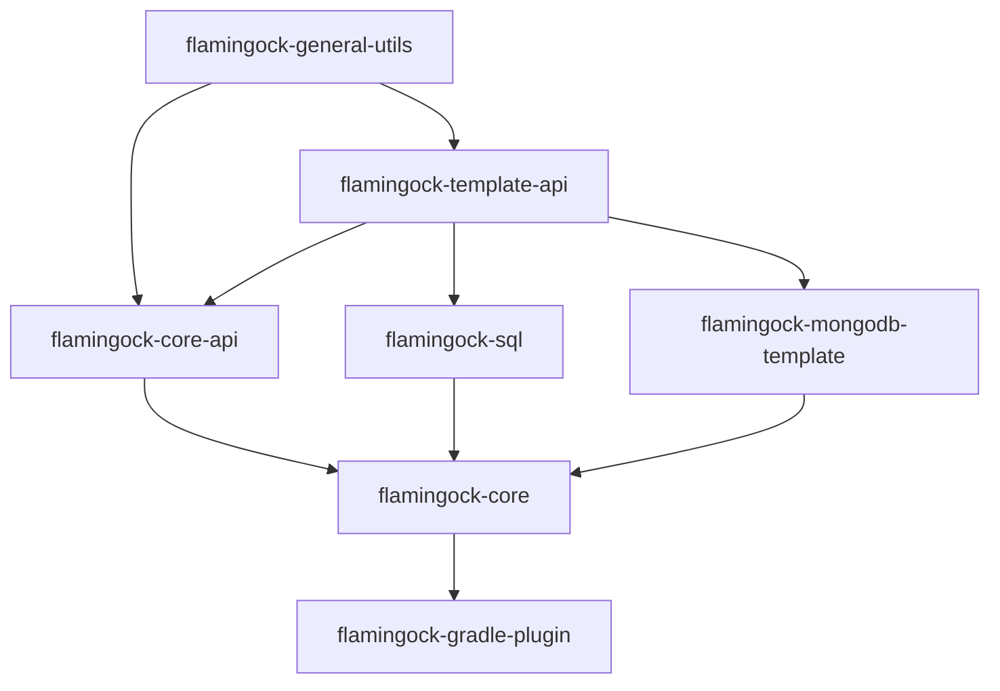

# Flamingock Version Dependencies

This diagram shows the version dependency relationships between Flamingock release units. Each block represents a unit with its own lifecycle and version. An arrow means "depends on" (the source must reference a version of the target).

The **flamingock-bom** (inside flamingock-core) exposes artifacts from all units listed here.

## Release order

When releasing, units must be released bottom-up. A version bump in a lower unit requires updating and releasing all units above it that reference it.

1. **flamingock-general-utils** (no Flamingock dependencies)
2. **flamingock-template-api**
3. **flamingock-core-api**, **flamingock-sql**, **flamingock-mongodb-template** (all depend on template-api/utils only)
4. **flamingock-core** (depends on all of the above)
5. **flamingock-gradle-plugin** (depends on all of the above)
